# valtr

`valtr` transforms a temporal logic task formula into a decomposed Value graph (DVG). 

The DVG, or "Value tree", represents a coupled set of Bellman equations that may be solved in dependency order to ultimately solve the optimal Value associated with the loigical formula (the root node). See [paper](https://willsharpless.github.io/valdec-site/) for more.

eg. 

`valtr 'F target_a && F target_b && G (!walls)' --mermaid` -->

```mermaid
%%{init: {"theme":"base","htmlLabels":true,"flowchart":{"padding":8},"themeVariables":{"background":"#FFFFFF00","fontFamily":"JetBrains Mono, Roboto Mono, Menlo, Consolas, monospace","edgeLabelBackground":"#FFFFFF","lineColor":"#2c3e50","defaultLinkColor":"#2c3e50"},"themeCSS":".edgeLabel rect { fill: #FFFFFF !important; stroke: #2c3e50 !important; stroke-width: 1px !important; rx: 999px; ry: 999px; } .edgeLabel span, .edgeLabel p { background: transparent !important; } .edgeLabel foreignObject { background: transparent !important; } .labelBkg { fill: #FFFFFF !important; } .flowchart-link, .edgePath path, .edge-thickness-normal, .edge-thickness-thick { stroke: #2c3e50 !important; stroke-width: 2.25px !important; fill: none !important; } .arrowheadPath { stroke: #2c3e50 !important; stroke-width: 2.25px !important; fill: #2c3e50 !important; } svg { background-color: transparent; }"}%%
flowchart LR
    n14@{ shape: braces, label: "root: task Value" }
    n0@{ shape: rectangle, label: "'target_a'" }
    n1@{ shape: rectangle, label: "'target_b'" }
    n2@{ shape: rectangle, label: "'walls'" }
    n3@{ shape: rounded, label: "neg." }
    n4@{ shape: rounded, label: "avoid Value (n.4)" }
    n5@{ shape: rounded, label: "min" }
    n6@{ shape: rounded, label: "reach-avoid Value (n.6)" }
    n7@{ shape: rounded, label: "min" }
    n8@{ shape: rounded, label: "min" }
    n9@{ shape: rounded, label: "reach-avoid Value (n.9)" }
    n10@{ shape: rounded, label: "min" }
    n11@{ shape: rounded, label: "max" }
    n12@{ shape: rounded, label: "reach-avoid Value (n.12)" }
    n15@{ shape: braces, label: "leaf: predicate fn." }
    n16@{ shape: braces, label: "" }
    n17@{ shape: braces, label: "" }
    n17@{ shape: braces, label: "" }
    n3 ==> n2
    n4 ==> n3
    n5 ==> n1
    n5 ==> n4
    n6 ==>|<span style="display:inline-block;padding:2px 6px;border-radius:999px;background:#FFFFFFF5;border:1px solid #86AECBF5;color:#4698E0 !important;opacity:1;">reach</span>| n5
    n6 ==>|<span style="display:inline-block;padding:2px 6px;border-radius:999px;background:#F7DDDDF5;border:1px solid #D99898F5;color:#D95454 !important;opacity:1;">avoid</span>| n3
    n7 ==> n0
    n7 ==> n6
    n8 ==> n0
    n8 ==> n4
    n9 ==>|<span style="display:inline-block;padding:2px 6px;border-radius:999px;background:#FFFFFFF5;border:1px solid #86AECBF5;color:#4698E0 !important;opacity:1;">reach</span>| n8
    n9 ==>|<span style="display:inline-block;padding:2px 6px;border-radius:999px;background:#F7DDDDF5;border:1px solid #D99898F5;color:#D95454 !important;opacity:1;">avoid</span>| n3
    n10 ==> n1
    n10 ==> n9
    n11 ==> n7
    n11 ==> n10
    n12 ==>|<span style="display:inline-block;padding:2px 6px;border-radius:999px;background:#FFFFFFF5;border:1px solid #86AECBF5;color:#4698E0 !important;opacity:1;">reach</span>| n11
    n12 ==>|<span style="display:inline-block;padding:2px 6px;border-radius:999px;background:#F7DDDDF5;border:1px solid #D99898F5;color:#D95454 !important;opacity:1;">avoid</span>| n3
    n0 ~~~ n15
    n1 ~~~ n15
    class n0 var;
    class n1 var;
    class n2 var;
    class n3 negate;
    class n4 avoid;
    class n5 min;
    class n6 reachavoid;
    class n7 min;
    class n8 min;
    class n9 reachavoid;
    class n10 min;
    class n11 max;
    class n12 reachavoid;
    class n17 hidden
    class n16 hidden
    classDef const fill:#95a5a688,stroke:#95a5a6,color:#111111,stroke-width:5px,font-size:25px;
    classDef var fill:#FFFFFF88,stroke:#FFFFFF,color:#111111,stroke-width:5px,font-size:20px;
    classDef min fill:#E9E0C488,stroke:#E9E0C4,color:#FFFFFF,stroke-width:5px,font-size:15px;
    classDef max fill:#D8CCA388,stroke:#D8CCA3,color:#FFFFFF,stroke-width:5px,font-size:15px;
    classDef reachavoid fill:#1B5B9388,stroke:#1B5B93,color:#FFFFFF,stroke-width:5px,font-size:25px;
    classDef avoid fill:#CD3A3A88,stroke:#CD3A3A,color:#FFFFFF,stroke-width:5px,font-size:25px;
    classDef reach fill:#1B5B9388,stroke:#1B5B93,color:#FFFFFF,stroke-width:5px,font-size:25px;
    classDef gu fill:#3AA65588,stroke:#3AA655,color:#111111,stroke-width:5px,font-size:25px;
    classDef gumin fill:#3AA65588,stroke:#3AA655,color:#111111,stroke-width:5px,font-size:25px;
    classDef negate fill:#B98EC888,stroke:#B98EC8,color:#FFFFFF,stroke-width:5px,font-size:15px;
    classDef hidden display: none;
    style n12 stroke:#1B5B93,stroke-width:8px;
```


The main workflow is:

1. **PARSE** a temporal logic formula
2. **LOWER** it to an intermediate representation (IR), akin to a temporal logic tree.
3. **PASS** over the IR to convert it via [decomposition rules](https://willsharpless.github.io/valdec-site/) to the DVG, a directed acyclic graph (DAG)
4. **SOLVE** the DVG/DAG to get the specification Value and optimal action/policy 

The final step can be done in multiple ways depending on the problem and desired accuracy:

- *Exactly for small discrete systems* such as gridworlds, via Value iteration using [`dvi`](https://github.com/oswinso/discrete_vi/tree/master)
- *Almost exactly for low-d continuous systems*, via HJ-PDE methods using [`hj_reachability`](https://github.com/StanfordASL/hj_reachability)
- *Approximately for general systems*, via RL using [`vdppo`](https://github.com/willsharpless/vdppo) 

## What Is Here

- `src/valtr/valtr.py`: main logic-to-DAG entry points such as `to_dag(...)`
- `src/valtr/solve_discrete.py`: discrete DAG solver built on top of `dvi`
- `src/valtr/safety_filter.py`: safety filtering over solved discrete tasks
- `src/valtr/control.py`, `src/valtr/solver_utils.py`: HJ-based continuous utilities
- `scripts/dvi/`: discrete gridworld and safety-filter demos
- `scripts/hj_reachability/`: HJ-based examples kept for the continuous workflow

RL examples using `valtr` can be found in [`vdppo`](https://github.com/willsharpless/vdppo).

## Installation

Baisc (no solving):

```bash
git clone https://github.com/willsharpless/valtr.git
cd valtr
pip install -e .
```

with backends (for solving the DVG DAG)

```bash
pip install -e ".[dvi]"
pip install -e ".[hj]"
```

See [`vdppo`](https://github.com/willsharpless/vdppo) for RL usage.

Notes:

- `.[hj]` installs the HJ stack used by the continuous examples.
- `.[dvi]` installs the pinned `dvi` dependency from the `discrete_vi` repository together with the extra packages used by the discrete scripts.
- Base installation now includes shared runtime dependencies such as `attrs`, `cyclopts`, `loguru`, and `tqdm`.

## Core Idea

The package takes formulas in the project temporal-logic syntax and lowers them through several stages:

- lex / parse source text into an AST
- lower the AST into a normalized IR
- apply rewrite passes such as `Finally -> Until` and globally-segment combination
- lower the IR into a DAG whose nodes represent operations like:
  `DAGVar`, `DAGNegate`, `DAGMinN`, `DAGMaxN`, `DAGReach`, `DAGAvoid`, and `DAGReachAvoid`
- solve those nodes in dependency order

The result is a value function or policy-like object that can be used for rollout, analysis, and safety filtering.

## CLI Usage

For simple conversion, the cli command `valtr` is provided upon installation. This can be used to convert a spec into the DVG and save or plot it.

```
valtr 'F target_a && F target_b && G (!walls)' --save
```

see the Visualization section for more details on rendering the graph.

## Python Usage

The most current high-level entry point on this branch is `to_dag(...)`:

```python
from valtr.valtr import to_dag

spec = "(!d1 U k1) && G(!w)"
dag, root = to_dag(spec)
```

For discrete solving, pass the DAG together with a `dvi` discrete dynamics model and predicate arrays:

```python
from valtr.solve_discrete import solve_discrete

dict_vars, dict_actions, dict_gu_vars, dict_gu_actions = solve_discrete(
    dyn,
    dag.nodes,
    dict_predicates,
)
```

In practice, the best examples are the scripts under:

- `scripts/dvi/rooms_discrete.py`
- `scripts/dvi/rooms_discrete_ma.py`
- `scripts/dvi/run_safety_filter.py`

## Running Examples

Discrete / `dvi` examples:

```bash
python scripts/dvi/rooms_discrete.py
python scripts/dvi/run_safety_filter.py
```

HJ examples:

```bash
python scripts/hj_reachability/rooms.py
python scripts/hj_reachability/rooms_dubins.py
```

Some scripts require extra dependencies or local environment setup beyond what is declared in `pyproject.toml`.

## Parsing Development

Note, some complex logical formulae are difficult to parse and may yield incorrect temporal logic trees, causing `valtr` to error. In such situations, the public tool spot is useful for reducing [formulae](https://slebok.github.io/proverb/spot.html) to standard form. Note, this package is not massively tested and the authors welcome community contributions.

## Visualization

For the example spec

```text
F target_a && F target_b && G !wall
```

you can use the CLI in three ways:

```bash
valtr 'F target_a && F target_b && G !wall'
valtr 'F target_a && F target_b && G !wall' --plot
valtr 'F target_a && F target_b && G !wall' --mermaid --vertical
```

- default output prints a colorized ASCII DAG in the terminal
- `--plot` writes a Graphviz-rendered PDF such as `value_tree_dag.pdf`
- `--mermaid` writes Mermaid graph text to `value_tree_dag.mmd`

To use `--plot`, you need both:

```bash
pip install graphviz
```

and Graphviz installed on the system.

macOS:

```bash
brew install graphviz
```

Windows:

1. Install Graphviz from `https://graphviz.org/download/`
2. Make sure the Graphviz `bin` directory is added to your `PATH`
3. Open a new terminal and verify with `dot -V`

The Mermaid export path does not need Graphviz. It simply writes a `.mmd` file that you can view in GitHub, Markdown tooling that supports Mermaid, or the Mermaid Live Editor.
